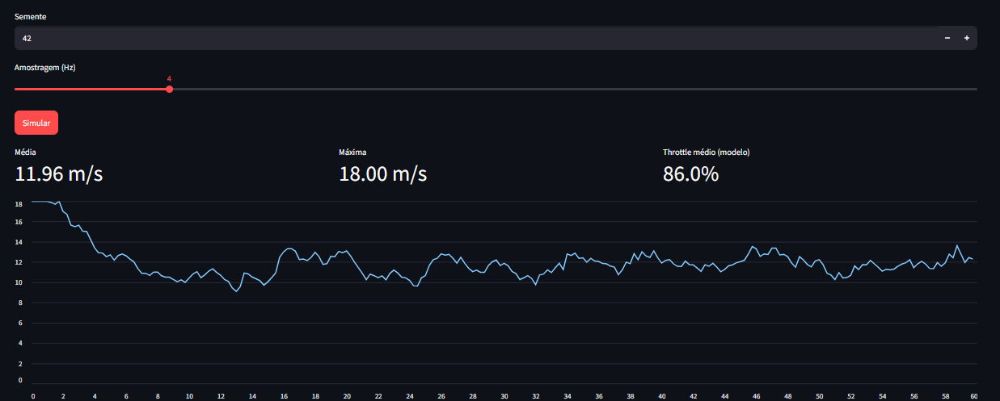

# Neural Offshore Wind Lab

[Português (Brasil)](README.pt-BR.md)

An academic Phase 1 prototype for an intelligent wind-generation system inspired by offshore
operating scenarios. The software converts a natural-language prompt into a reproducible wind
profile, generates a Weibull-based time series, and uses a lightweight neural network to estimate
the command for one brushless motor.

> **Safety notice:** hardware control is disabled by default. Never perform initial tests with a
> propeller installed. A physical emergency stop, current-limited power supply, mechanical
> shielding, secure mounting, and direct supervision were established as requirements. The experimental MSP backend must be
> validated against the installed Betaflight version before the ESC is energized.

## Phase 1 deliverables

- reproducible Weibull wind generator with gusts and temporal correlation;
- lightweight NumPy MLP: `(target wind speed, distance) -> throttle`;
- controlled English and Portuguese prompt parsing without cloud services;
- CSV export and PNG wind-speed plots;
- Streamlit dashboard, operational bench app, and command-line interface;
- unit tests;
- simulated actuator and opt-in experimental Betaflight/MSP backend;
- system architecture, technical documentation, implementation plan, and roadmap.

## Quick start

```bash
python -m venv .venv
# Linux/Raspberry Pi: source .venv/bin/activate
# Windows: .venv\Scripts\activate
pip install -e ".[dev]"
python scripts/train_model.py
neural-wind-lab simulate --prompt "offshore wind at 12 m/s, gusts of 18 m/s for 60 s at 1.5 m"
streamlit run app.py
pytest
```

Generated files are written to `artifacts/`. Set a fixed random seed to reproduce an experiment.

The app has two tabs: Weibull/MLP simulation and **Bench Tests**. The bench tab generates throttle
profiles, plots them, prepares copy-ready commands, exports Markdown/CSV records, and runs Bench
Test 3 on the motor after the laboratory confirmations are selected.

## Prompt examples

```text
steady wind at 8 m/s for 30 s at 1 m
moderate offshore scenario, 12 m/s, gusts of 18 m/s for 2 min at 1500 mm
vento forte de 45 km/h durante 90 s a 2 m
```

Internally, the project uses SI units. The current deterministic parser accepts `m/s`, `km/h`,
seconds/minutes, and distances in `m` or `mm`.

## Available hardware and integration decision

The original proposal assumed a Raspberry Pi 5, Pixhawk, and MAVLink. The available prototype
uses a Raspberry Pi 2B and a SpeedyBee F405 V4, generally associated with Betaflight/MSP. This
version therefore does not pretend that MAVLink compatibility exists. The Raspberry Pi handles
scenario generation, inference, logging, and supervision; the F405 remains responsible for the
time-critical ESC signal.

For the first Raspberry Pi 2B + SpeedyBee F405 V4 + one-motor test, see the Portuguese
[Bench Test 1 and filming guide](docs/BENCH_TEST_1.pt-BR.md). The workflow starts in mock
mode, performs a read-only MSP probe, and only then permits a short, explicitly confirmed spin.

## Bench results

Bench Test 1 was completed successfully: the motor respected the configured throttle ceiling and
execution time. After the test, the normal shutdown path was updated to include a controlled ramp
down to 0%, while immediate stop remains reserved for interruptions and failures.

Bench Test 2 was also completed successfully, validating the gradient profile. Bench Test 3 was
completed successfully, with 61 samples showing the best shutdown-ramp behavior. Bench Test 4 now
targets endurance testing, prompt-based neural commands, 1-4 motor layouts, and RPM records.

The bench application is now part of `app.py`, centralizing planning, profile visualization,
command previews, test records, and guarded physical execution for Bench Test 3.

- [Results and observations - Portuguese](docs/RESULTS_AND_OBSERVATIONS.pt-BR.md)
- [Bench Test 2 - Portuguese](docs/BENCH_TEST_2.pt-BR.md)
- [Bench Test 3 - Portuguese](docs/BENCH_TEST_3.pt-BR.md)
- [Bench Test 4 - Portuguese](docs/BENCH_TEST_4.pt-BR.md)
- [Bench Test 1 video](docs/media/bench-test-1-motor-run.mp4)
- [Bench Test 2 video](docs/media/bench-test-2-gradient-run.mp4)



## Neural motor-control implementation

- `src/labo_gerador_de_ventos/models/mlp.py`: defining, training, and running the MLP;
- `src/labo_gerador_de_ventos/prompt.py`: converting prompts into wind and distance values;
- `src/labo_gerador_de_ventos/control/neural_command.py`: converting MLP output into a
  safety-limited throttle command;
- `src/labo_gerador_de_ventos/control/actuator.py`: applying the ramp, stop, and MSP frame;
- `scripts/bench_test_1.py`: integrating the layers through `neural-mock` and `neural-motor`.
- `scripts/bench_test_2.py`: preparing the gradient profile `0% -> 10% -> 60% -> 25% -> 0%`.
- `scripts/bench_test_3.py`: planning 2 s ramp up, maximum-throttle hold, and 2 s ramp down.
- `scripts/bench_test_4.py`: running prompt-based neural endurance tests for 1-4 motor layouts.
- `src/labo_gerador_de_ventos/control/neural_array.py`: distributing neural throttle by position.

```text
prompt -> parser -> MLP -> predicted throttle -> 10% ceiling -> ramp -> F405/ESC -> motor
```

Python 3.12 is the project target. Confirm that it is available for the Raspberry Pi OS image and
CPU architecture in use. The Pi 2 has limited resources, so model training should happen offline;
only inference should run during control.

## Repository structure

```text
NEURAL_OFFSHORE_WIND_LAB/
├── app.py
├── config/default.json
├── docs/
│   └── en/
├── scripts/train_model.py
├── src/labo_gerador_de_ventos/
│   ├── control/
│   ├── models/
│   └── *.py
├── tests/
└── artifacts/
```

The internal Python package keeps its original Portuguese identifier for backward compatibility.

## Safe experimental workflow

1. Validating the full pipeline with the mock actuator.
2. Using synthetic data only for software integration.
3. Collecting real measurements using an anemometer: distance, throttle/RPM, and measured wind.
4. Retraining and validating the MLP using held-out real data.
5. Testing communication without a propeller and with current limiting.
6. Enabling physical output only after the hardware checklist has passed.
7. Evolving the workflow into a dedicated application to reduce manual commands during bench tests.

## Scientific limitations

Weibull describes wind-speed statistics; it is not CFD or a complete turbulence-spectrum model.
The initial MLP learns a synthetic plant and is not a calibrated physical controller. Petrobras or
industrial use requires traceable calibration, uncertainty analysis, independent risk assessment,
sensor feedback, and validation against applicable standards.

## Documentation

- [System architecture](docs/en/architecture.md)
- [Technical documentation](docs/en/technical.md)
- [Hardware and safety](docs/en/hardware.md)
- [Implementation plan](docs/en/implementation_plan.md)
- [Roadmap](docs/en/roadmap.md)
