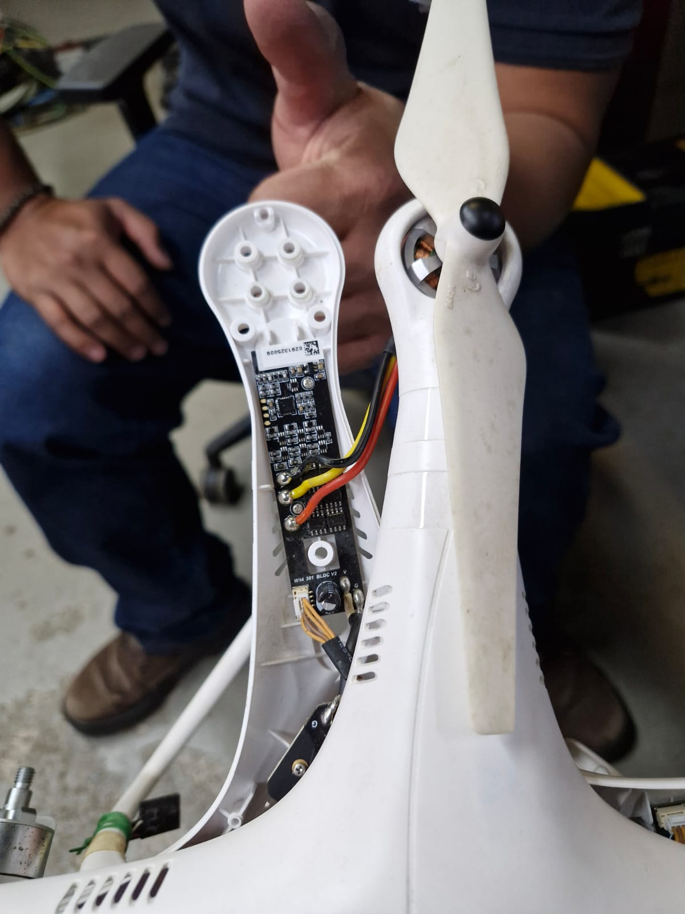

# Bench Test 6 — Controle contínuo com quatro motores

O Bench Test 6 escala a bancada de um para quatro motores e introduz um modo manual contínuo no
aplicativo. O operador informa a velocidade desejada no plano do modelo e a distância entre o
arranjo e esse plano. O comando pode ser alterado durante o ensaio sem reiniciar o processo.

```text
velocidade + distância -> modelo provisório -> throttle -> M1 + M2 + M3 + M4
```

Ao selecionar outro teste ou pressionar **Parar motor**, o controlador reduz o throttle em rampa e
envia o comando de parada. Um watchdog também interrompe o ensaio se o aplicativo deixar de
atualizar o arquivo de comando por 30 segundos.

## Hardware desta etapa

- quatro motores outrunner provenientes de DJI Phantom 2;
- quatro saídas de motor da controladora: `M1`, `M2`, `M3` e `M4`;
- ESC compatível com as quatro saídas e com a corrente do conjunto;
- fonte de bancada dimensionada para a corrente simultânea dos quatro motores;
- anemômetro posicionado no plano do modelo;
- corte físico de energia acessível ao operador.

Os motores do Phantom 2 podem pertencer a revisões diferentes. Antes do ensaio, deve ser confirmada
a marcação individual (`2212` ou `2312`), assim como tensão, hélice, ESC e sentido de giro. Motores,
hélices e ESCs de revisões incompatíveis não devem ser misturados sem validação separada.

## Arranjo físico inicial

O ponto de partida adotado é uma matriz quadrada `2 × 2`:

```text
M1 — superior esquerdo     M2 — superior direito

M4 — inferior esquerdo     M3 — inferior direito
```

Motores vizinhos devem girar em sentidos opostos; motores diagonais podem girar no mesmo sentido.
Todos os eixos devem permanecer paralelos, as hélices devem ficar no mesmo plano e o centro da
matriz deve ser alinhado ao centro do modelo.

Essa geometria é apenas o ponto de partida. A posição final deverá ser definida por mapeamento do
campo de vento no plano do modelo. Uma grade mínima de nove pontos permite comparar centro, bordas e
cantos:

```text
P1  P2  P3
P4  P5  P6
P7  P8  P9
```

Para cada ponto devem ser registrados velocidade média, pico, distância, throttle, tensão e
observações de turbulência. Se o centro ficar fraco, deve-se avaliar aproximação entre motores,
maior distância de mistura ou retificador de fluxo. Se o centro ficar muito forte e os cantos
fracos, deve-se avaliar maior espaçamento entre os motores.

## Execução pelo aplicativo

Abra o aplicativo com o pacote local visível ao Python:

```bash
cd ~/windgen-simulator
source .venv/bin/activate
PYTHONPATH="$PWD/src" python -m streamlit run app.py
```

Na aba **Bench Tests**:

1. selecione **Controle manual contínuo**;
2. em **Arranjo de motores**, selecione **4 motores — matriz 2×2 (M1–M4)**;
3. informe velocidade desejada, distância e porta da controladora;
4. defina inicialmente um limite de throttle conservador;
5. confirme fixação, supervisão e corte físico;
6. pressione **Iniciar controle contínuo**.

O valor de velocidade e a distância podem ser alterados enquanto o processo permanece ativo. O
script envia o mesmo throttle para as quatro saídas nesta primeira versão.

## Confirmação das quatro saídas

Antes do primeiro ensaio conjunto, teste os motores individualmente e sem hélices. Durante a
execução com quatro motores, o log deve começar com:

```text
Manual continuous control ready. outputs=M1,M2,M3,M4
```

As linhas seguintes devem registrar os quatro comandos:

```text
M1=25.0% M2=25.0% M3=25.0% M4=25.0%
```

Para acompanhar o arquivo:

```bash
tail -f artifacts/control/manual_control.log
```

Se apenas um motor girar, primeiro confirme no app que não foi selecionado **1 motor — calibração
(M1)**. Se o log mostrar `M1` a `M4` e somente um motor responder fisicamente, devem ser verificadas
as saídas, o mapeamento do Betaflight, os ESCs e a alimentação.

Para localizar controladores antigos ainda ativos:

```bash
pgrep -af manual_continuous
```

## Parada

A parada operacional deve ser feita pelo botão **Parar motor** ou pela seleção de outro teste no
aplicativo. Em condição anormal, utilize o corte físico de energia.

O controlador consome a confirmação de cada comando `MSP_SET_MOTOR`, evitando acúmulo de respostas
na serial durante execução prolongada. Ao terminar, envia parada duas vezes antes de fechar a porta.

## Calibração pendente

A relação atual entre velocidade, distância e throttle ainda vem do modelo sintético. Em uma
medição preliminar com anemômetro melhor, um alvo de `1 m/s` a `1 m` produziu aproximadamente
`3 m/s`. Portanto, o valor solicitado no aplicativo ainda não deve ser tratado como velocidade
calibrada.

Não será aplicada uma simples divisão por três: a relação pode variar com throttle, distância,
hélices, interação entre os quatro jatos e posição no plano. A calibração deverá coletar uma matriz
de dados reais e substituir o modelo provisório.

Campos mínimos por amostra:

```text
data/hora, distância, alvo, throttle, M1, M2, M3, M4,
vento médio, vento máximo, tensão, corrente e observações
```

## Registro visual de 25 de setembro de 2026

O registro desta etapa documenta a montagem provisória da matriz, a operação pelo aplicativo e os
instrumentos disponíveis para a calibração. As imagens comprovam a configuração experimental, mas
não substituem a planilha de medições nem caracterizam, sozinhas, a uniformidade do campo de vento.


*Montagem provisória dos quatro motores sobre duas bases, com alimentação, computador de controle
e cabeamento utilizados no ensaio.*



*Inspeção de um braço DJI Phantom aberto, mostrando o motor, a hélice e a placa eletrônica original.
O registro auxilia a identificação das revisões e conexões antes da integração definitiva.*


*Anemômetro de fio quente Testo 416, adotado como instrumento de referência para as próximas
medições no plano do modelo.*

- [Vídeo — seleção da saída de motor pelo aplicativo](media/bench-test-6-motor-output-selection.mp4)
- [Vídeo — montagem e operação da bancada com quatro motores](media/bench-test-6-four-motor-operation.mp4)
- [Vídeo — ensaio anterior com medição por anemômetro](media/bench-test-5-anemometer-measurement.mp4)

O primeiro vídeo também registra a verificação funcional do identificador da saída de motor. Essa
verificação é importante porque quantidade e identificação são parâmetros independentes: selecionar
um motor em `M4`, por exemplo, deve comandar somente a saída física `M4`.

## Critério para concluir o Bench Test 6

O ensaio poderá ser considerado concluído quando:

- M1–M4 responderem simultaneamente e mantiverem rotação contínua;
- alterações de velocidade durante o ensaio forem aplicadas sem reiniciar o processo;
- a saída do modo acionar rampa e parada dos quatro motores;
- o mapa espacial de vento no plano do modelo estiver registrado;
- a repetibilidade for avaliada em pelo menos três execuções por ponto;
- limites elétricos e térmicos permanecerem dentro das especificações dos componentes.
