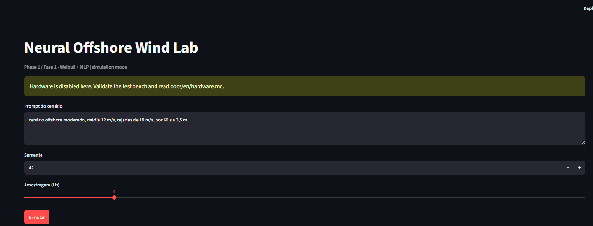
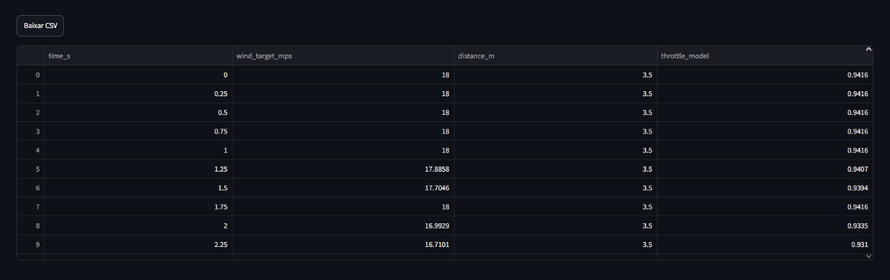

# Resultados e observações

## Bench Test 1

O primeiro ensaio de bancada foi concluído com sucesso. O motor respeitou o limite de throttle
configurado e o tempo de execução definido. A execução também confirmou que o pipeline
`prompt -> rede neural -> limitador -> F405/ESC -> motor` ficou operacional para um motor em baixa
potência.

## Bench Test 2

O segundo ensaio de bancada foi concluído com sucesso. A execução registrou a evolução do controle
para um perfil com mudança de gradiente, avançando do giro curto em baixa potência para uma
sequência com patamares intermediários de throttle.

## Bench Test 3

O terceiro ensaio de bancada foi concluído com sucesso. A configuração com 61 amostras apresentou
melhor resposta na rampa de finalização, sem movimento residual perceptível. O resultado passou a
servir como referência para os perfis seguintes.

## Bench Test 4

O Bench Test 4 foi estruturado como ensaio de exaustão e comando neural por prompt. A duração-alvo
foi definida em torno de 10 minutos, com preparação para layout de 1 a 4 motores em cruz ou em X e
registro de RPM.

O ensaio de maior duração funcionou melhor pelo terminal, com visualização clara do throttle alvo.
Também ficou registrado que o motor ainda não obedeceu ao throttle de modo confiável, portanto o
controle neural ainda não foi considerado fechado. A execução pelo app precisou evoluir para não
depender de porcentagem manual.

## Bench Test 5

O Bench Test 5 foi definido para implementar comando neural no terminal e no app, junto com
feedback de velocidade atual do vento. A leitura real de vento foi separada da leitura de RPM:
vento exige anemômetro ou sensor externo; RPM continua como telemetria/instrumentação do motor.

Após avaliação do app, ficou registrado que o Bench Test 5 não deve pedir porcentagem manual de
throttle como parâmetro principal. O comando deve partir do prompt, com a rede neural calculando o
throttle necessário. O app foi simplificado nessa direção.

A leitura de RPM pela stack SpeedyBee foi considerada possível, mas ainda não confiável com o motor
inrunner usado nesta fase. Ao habilitar Bidirectional DShot, o motor apresentou movimento aos
“trotes”, sem rotação contínua estável. A leitura de anemômetro foi mantida como instrumento externo
de bancada, sem necessidade de inclusão no app nesta etapa.

Em seguida, foram realizados testes com motor outrunner. A resposta ao throttle melhorou bastante,
embora a leitura de RPM pelo SpeedyBee ainda não tenha sido obtida. O motor registrado foi
**HYPERION ZS3025B-10**, com velocidade máxima de bancada definida em **19 m/s**. A amostragem de
`0.1 s` pelo terminal apresentou melhor resposta e reduziu engasgos durante a rampa. O vídeo
registrado nessa etapa não correspondeu a execução pelo app.

## Melhorias incorporadas

- A rampa de parada foi adicionada ao fluxo normal do `scripts/bench_test_1.py`.
- A parada imediata foi mantida para interrupções e falhas.
- O perfil do Bench Test 2 foi preparado com a sequência `rampa -> 10% -> 60% -> 25% -> rampa`.
- O Bench Test 2 foi registrado como concluído e passou a compor a trilha experimental do projeto.
- O Bench Test 3 foi estruturado como próxima etapa, com rampa de 2 s para subida e descida.
- O aplicativo de bancada foi atualizado para execução física guardada do Bench Test 3.
- O Bench Test 4 foi adicionado com comando por prompt neural, duração longa e layout multimotor.
- O Bench Test 5 foi adicionado com feedback de vento atual e fonte de sensor `simulated`/`serial`.
- O app do Bench Test 5 foi ajustado para comando por prompt neural, sem controle manual principal
  de throttle.
- O parser de prompt passou a aceitar durações compactas como `15s` e `15 s`.
- O comando de STOP foi corrigido para criar uma trava persistente e acionar uma rampa de parada,
  impedindo que o loop ativo volte a enviar throttle após um frame isolado de parada.
- As mídias do Bench Test 5 com motor outrunner foram adicionadas ao repositório.
- A documentação passou a registrar a necessidade de uma aplicação dedicada para facilitar a
  operação em bancada.
- As mídias do dashboard e do ensaio passaram a ser referenciadas no repositório.

## Mídias

- [Vídeo do Bench Test 1](media/bench-test-1-motor-run.mp4)
- [Vídeo do Bench Test 2](media/bench-test-2-gradient-run.mp4)
- [Vídeo do Bench Test 5 - resposta com outrunner](media/bench-test-5-outrunner-throttle-response.mp4)
- [Vídeo do Bench Test 5 - terminal com amostragem 0.1 s](media/bench-test-5-terminal-sampling-010.mp4)
- [Dashboard - entrada do cenário](media/dashboard-input.png)
- [Dashboard - gráfico de velocidade](media/dashboard-plot.png)
- [Dashboard - tabela exportável](media/dashboard-table.png)

