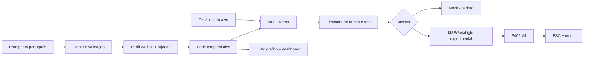

# Arquitetura do sistema

## Componentes

| Camada | Responsabilidade |
|---|---|
| Interface | Prompt, CLI e Streamlit |
| Domínio | Validação de cenário e unidades SI |
| Simulação | Weibull, correlação temporal e limite de rajada |
| IA | MLP inversa de duas entradas e uma saída |
| Segurança | Saturação, rampa, bloqueio de hardware e parada |
| Integração | Mock ou MSP serial experimental |
| Dados | CSV de séries e modelo NPZ |

O treinamento não ocorre no laço de controle. A inferência é pequena e determinística. Em uma
evolução de malha fechada, o anemômetro entra como realimentação e um controlador supervisor
corrige o comando estimado pela MLP.

