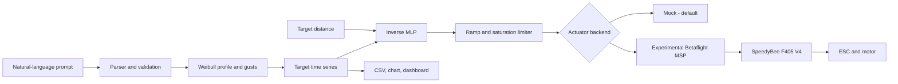

# System architecture

| Layer | Responsibility |
|---|---|
| Interface | Prompt, CLI, and Streamlit dashboard |
| Domain | Scenario validation and SI-unit conversion |
| Simulation | Weibull distribution, temporal correlation, gust limiting |
| AI | Two-input, one-output inverse MLP |
| Safety | Saturation, ramp limiting, hardware lock, emergency stop |
| Integration | Mock or experimental serial MSP backend |
| Data | CSV time series and NPZ model files |

Training is kept outside the control loop. In a future closed-loop version, an anemometer supplies
feedback while a supervisory controller corrects the MLP feed-forward command.

